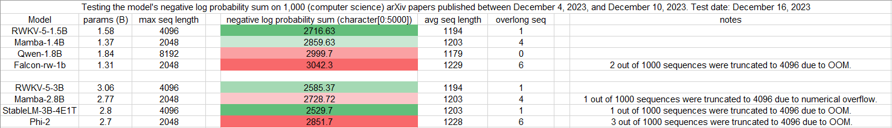

## Uncheatable Eval

- Assessing the capabilities of LLMs is a challenging task. 

- Public benchmarks are susceptible to gaming, and testing the models with real-time, fresh data might be a solution. 

- Here, I attempt to evaluate the language model's ability to model using new arXiv papers. 

- In the future, I plan to try more real-time corpora, such as news articles. 

Below are some test results.

-----

-----
Below are some old test results, with slight differences in testing methods compared to the current code.

