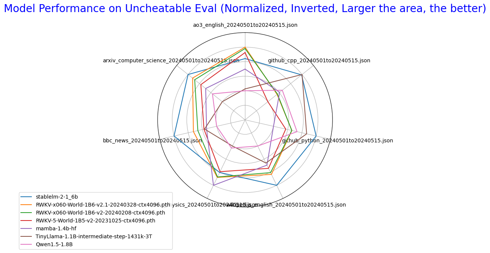
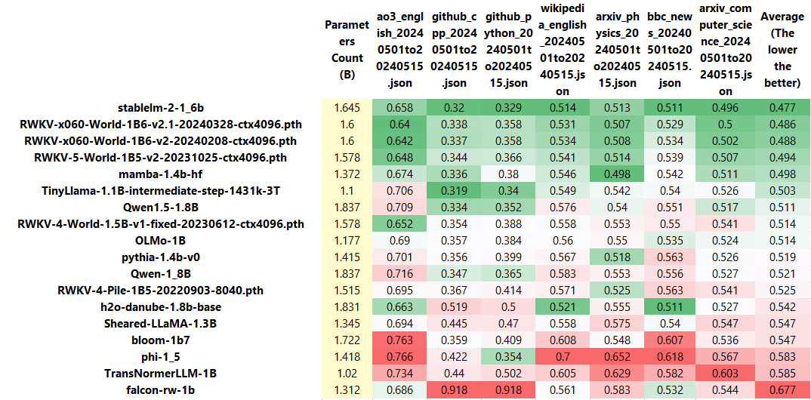
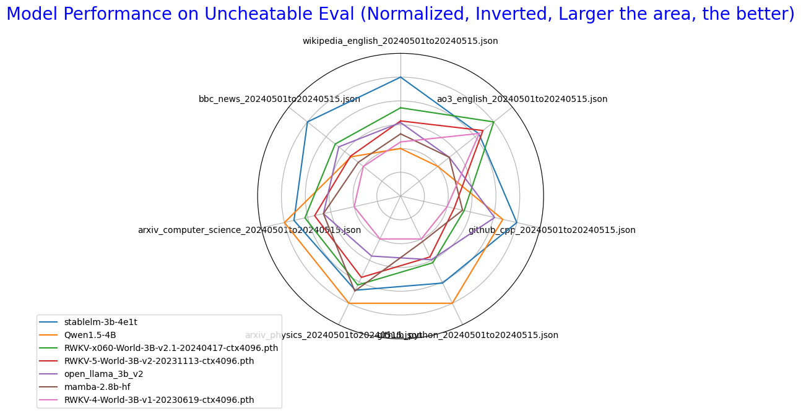
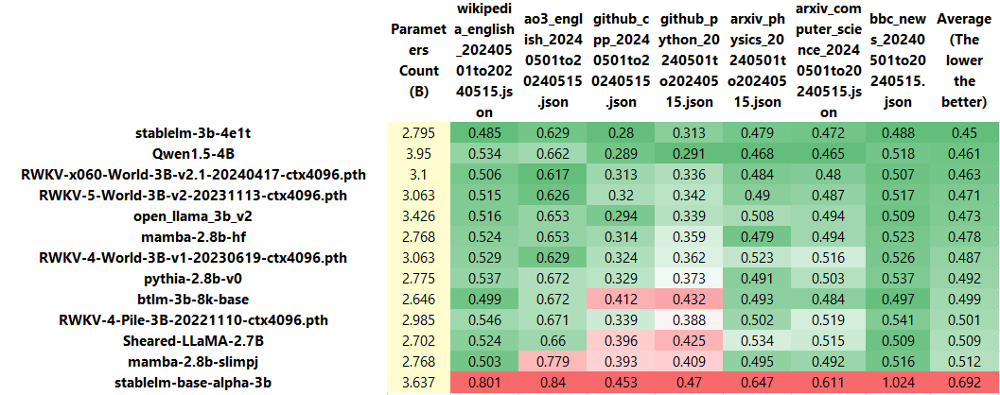
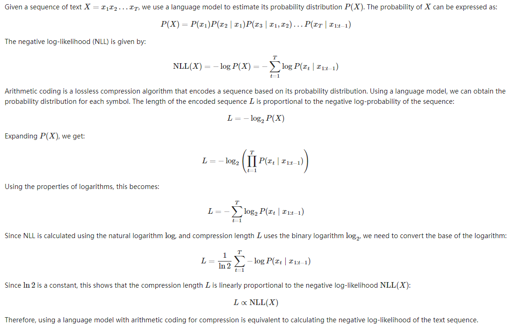

# Uncheatable Eval

## Introduction
Traditional LLM benchmarks are easily compromised by unintentional or intentional data leaks, 
making many benchmarks unreliable and unable to truly reflect the capabilities of LLMs. 

Uncheatable Eval addresses this issue by testing LLMs on real-time, newly generated data from the internet, 
ensuring that the evaluation is immune to data leaks and cannot be gamed.

## How?
Uncheatable Eval assesses the language modeling capabilities of LLMs on new data from various sources such as recent papers on arXiv, new projects on GitHub, news articles, and more. Since this data is brand new (e.g., from the past 1-2 weeks), it is impossible for these data to be included in the training sets of publicly released models, thus avoiding the impact of unintentional or intentional data leaks.

Specifically, we calculate the sum of negative log probabilities of the models on these texts. In other words, models that are more likely to generate these texts are considered better.

*Note* : Uncheatable Eval only tests base models.

## Q&A
### Why Calculate the Sum of Negative Log Probabilities?
First, the goal of language models, at least today's language models, is to generate text that is as realistic as possible, maximizing the probability of real text. They are trained and designed to do exactly this. Calculating the sum of negative log probabilities on real text is the most direct way to test this capability.

Second, from the perspective of "compression is intelligence," a good way to test a language model would be to use the model with an entropy coding algorithm for compression and test the model's compression rate [[1]](https://arxiv.org/abs/2309.10668)[[2]](https://arxiv.org/abs/2402.00861). A model with a higher compression rate is considered better. Using a language model + arithmetic coding as an example, it is easy to prove that a model's ability to compress a piece of text is proportional to the sum of its negative log probabilities on that text (see [proof](#proof-of-the-equivalence-between-compression-capability-and-negative-log-probability-sum)).

### Can Models Using Different Tokenizers Be Directly Compared?
Yes. When calculating the sum of negative log probabilities, we essentially treat the model + tokenizer as a single entity or system. As long as this system has a high probability of generating real text, we consider it better. From the perspective of compression, you can choose any tokenizer. From the compression rate perspective, we don't care; we only care about whether your system can compress the text more effectively.

### Is It Really Uncheatable? Can't I train my model on a large number of arXiv papers to improve its test performance on arXiv papers?
Uncheatable Eval's data sources currently include new arXiv papers, new GitHub projects, BBC news, AO3 fanfictions, and new Wikipedia entries, with more sources to be added in the future. If you genuinely achieve excellent results across these data by training extensively on these sources, I would consider you to have developed a genuinely good language model rather than cheating.

From my test results, accurately modeling these data is very challenging. I believe Uncheatable Eval more accurately reflects the value of every bit of data and computational power you invest compared to other benchmarks. Models trained with more data and computational power are almost always better, and there are no shortcuts. This is a key strength of Uncheatable Eval.

### Is This Too "Random"? Why Consider Random Texts from the Internet as Ground Truth?
This is why we choose rigorous and verified texts such as arXiv papers and news reports, which typically have better quality. Additionally, a round of Uncheatable Eval evaluates a model over millions of tokens, increasing the reliability of the results.

In fact, the model rankings obtained through Uncheatable Eval are very stable. For instance, the model ranked first in January's data is highly likely to remain first in March, April, May, and June, indicating that the data obtained through this method is sufficiently representative.

# Guide

**Uncheatable Eval** now supports the evaluation of typical **Hugging Face** models and **RWKV** models. By following these four simple steps, you can easily obtain evaluation results:

## Step 1: Prepare Datasets

2 options for preparing your dataset:

- Use the datasets provided in the `data` directory.
- Open `my_bash_script.sh`, modify `START_DATE`, `END_DATE`, and `GITHUB_ACCESS_TOKEN`, then run the script to fetch real-time data.

## Step 2: Prepare Models

- **Uncheatable Eval** now supports the Hugging Face `AutoModelForCausalLM` and RWKV models (in .pth format). You can download the models on your own, or use the `utils/download_models.py` script to download multiple models to a temporary directory at once (please modify the list of models in the .py file as needed). 

## Step 3: Evaluate Models

### Evaluating a Single Model

- Use the `eval_model.py` script to evaluate a single model. Execute the following command:

  ```
  python3 eval_model.py --model <model> --model_type <model_type> --data <data> --log_path <log path> --chunk_size <chunk size>
  ```

  The parameters are as follows:

  - `model`: The name of the Hugging Face model or the path to the RWKV model's weight file.
  - `model_type`: The type of model, choose from `hf`, `rwkv`, `rwkv4pile`, `mamba`.
      - `hf` for Hugging Face `AutoModelForCausalLM`.
      - `rwkv` for RWKV-4-World models or newer RWKV models.
      - `rwkv4pile` for RWKV-4-Pile models.
      - `mamba` for evaluating Mamba models.
  - `data`: The path to the dataset used for evaluation.
  
  By default, log data will be saved in the "logs" folder.

### Batch Evaluation of Multiple Models

- You can also use `eval_multiple_models.py` to batch evaluate multiple models on multiple datasets. Simply modify the dataset and model list in the file, and then run:

  ```
  python3 eval_multiple_models.py
  ```

## Step 4: Parse and Visualize Results

- Run `show_results.ipynb` to parse and visualize the evaluation results.

# Results

~1B models



---



---



~3B models

---



---


## Proof of the Equivalence Between Compression Capability and Negative Log Probability Sum

