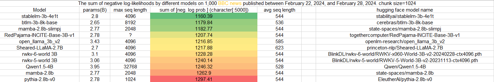
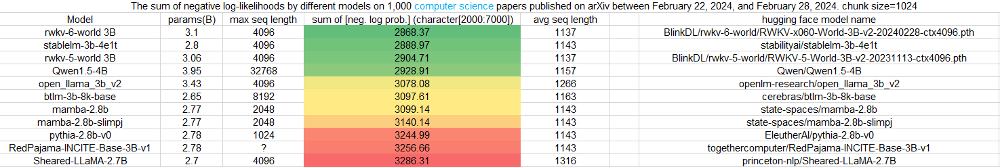
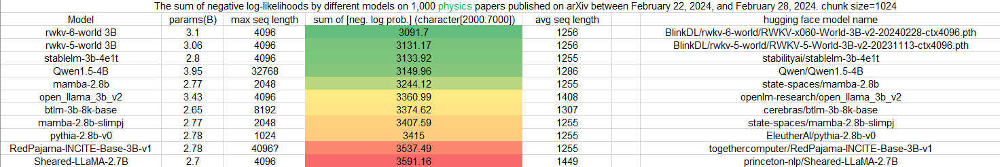
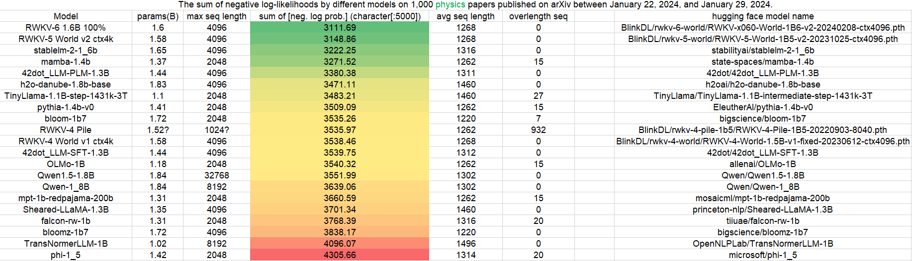
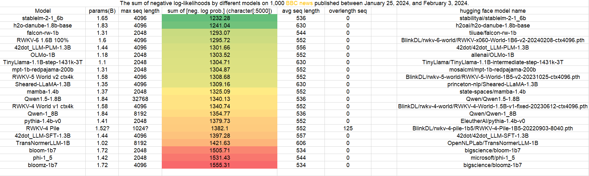
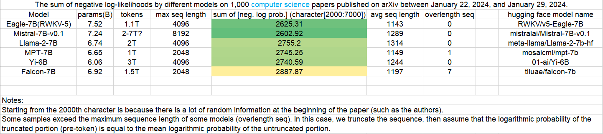
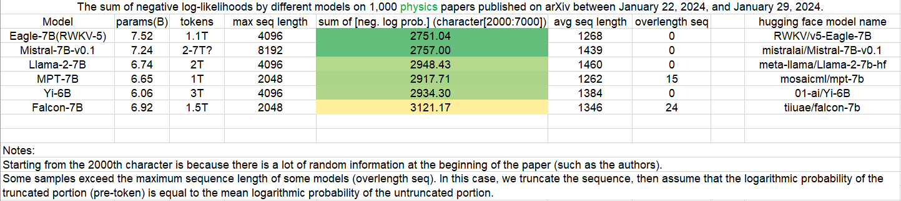

## Uncheatable Eval

- Assessing the capabilities of LLMs is a challenging task. 

- Public benchmarks are susceptible to gaming, and testing the models with real-time, fresh data might be a solution. 

- Here, I attempt to evaluate the language model's ability to model using new arXiv papers. 

- In the future, I plan to try more real-time corpora, such as news articles. 


## Getting Started

1. Create Your Dataset

Run `download_arxiv.ipynb` or `simple_bbc_crawler.ipynb` to download papers from arXiv or news from CNN for a specified date, and obtain a neatly organized dataset (in json format). You can also skip this step and directly use the dataset provided in the repository.

2. Evaluate the Model

There are two ways to evaluate the model:

- **Option 1**: Run `uncheatable_eval.ipynb` to evaluate the model.

- **Option 2**: Execute the following command:
  ```
  python eval_model.py --model <model> --model_type <model_type> --data <data> --log_path <log path> --chunk_size <chunk size>
  ```
  
  - `model`: Name of the Huggingface model or the path to the RWKV model weights file.
  - `model_type`: Type of the model. Choose from `hf`, `rwkv`, `rwkv4pile`, `mamba`.
  - `data`: The dataset (json file) used for evaluation.
  - `log_path`: Optional parameter, the path to save log files, default is `'./logs/'`.
  - `chunk_size`: Optional parameter, the sequence length for each input to the model.


## Results

Below are some test results.


---

---

---

Below are some old test results, with slight differences in testing methods compared to the current code.


---

---

---

---

---
