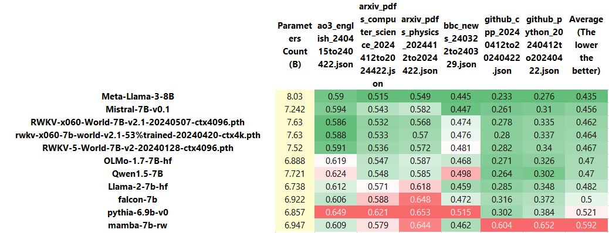
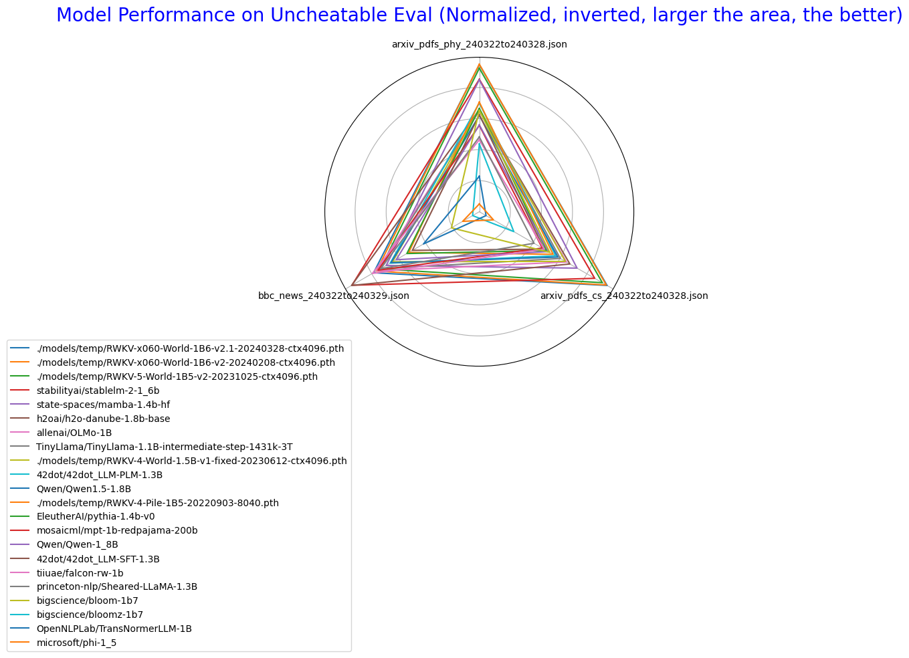
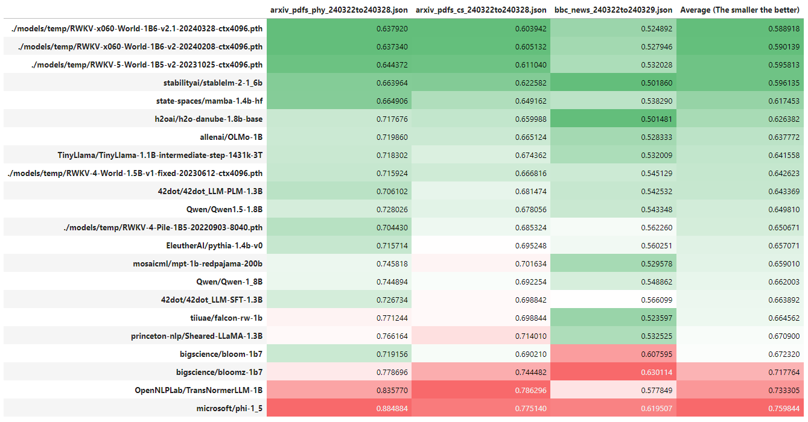
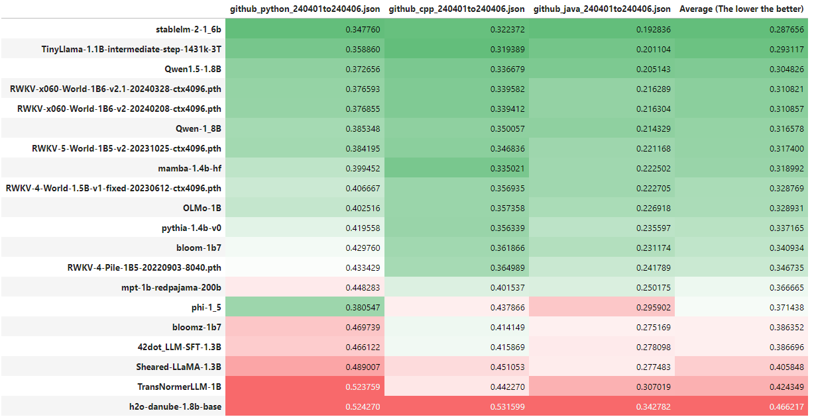

# Uncheatable Eval

- Assessing the capabilities of LLMs is a challenging task.

- Public benchmarks are susceptible to gaming, and testing the models with real-time, fresh data might be a solution.

- Current data sources: arXiv papers, BBC news, AO3 fanfiction, GitHub projects, Wikipedia.


# Guide

**Uncheatable Eval** now supports the evaluation of typical **Hugging Face** models and **RWKV** models. By following these four simple steps, you can easily obtain evaluation results:

## Step 1: Prepare the Dataset

2 options for preparing your dataset:

- Use the datasets provided in the `data` directory.
- Run `simple_bbc_crawler.ipynb` to fetch the latest BBC news dataset, or run `download_arxiv.ipynb` to get the latest arXiv papers, or run `github_crawler.py` to get the latest GitHub repos. Adjust the target time period to your needs. These scripts will automatically build the dataset in JSON format.

## Step 2: Prepare the Model

- **Uncheatable Eval** now supports the Hugging Face `AutoModelForCausalLM` and RWKV models (in .pth format). You can download the models on your own, or use the `utils/download_models.py` script to download multiple models to a temporary directory at once (please modify the list of models in the .py file as needed). 

## Step 3: Evaluate the Model

### Evaluating a Single Model

- Use the `eval_model.py` script to evaluate a single model. Execute the following command:

  ```
  python3 eval_model.py --model <model> --model_type <model_type> --data <data> --log_path <log path> --chunk_size <chunk size>
  ```

  The parameters are as follows:

  - `model`: The name of the Hugging Face model or the path to the RWKV model's weight file.
  - `model_type`: The type of model, choose from `hf`, `rwkv`, `rwkv4pile`, `mamba`.
      - `hf` for general Hugging Face `AutoModelForCausalLM`.
      - `rwkv` for RWKV-4-World models or newer RWKV models.
      - `rwkv4pile` for RWKV-4-Pile models.
      - `mamba` for evaluating Mamba models.
  - `data`: The path to the dataset used for evaluation.
  - `log_path`: (Optional) The path to save log files, default is `./logs/`.
  - `chunk_size`: (Optional) The sequence length for each input to the model, default is 1024.

### Batch Evaluation of Multiple Models

- You can also use `eval_multiple_models.py` to batch evaluate multiple models on multiple datasets. Simply modify the dataset and model list in the file, and then run:

  ```
  python3 eval_multiple_models.py
  ```

  All log files will be saved in the `log_current time` folder.

## Step 4: Parse and Visualize Results

- Run `show_results.ipynb` to parse and visualize the evaluation results. Please ensure to modify the `folder_path` parameter to your log file directory to properly load and display the results.

# Results

Below are some test results.


---

[//]: # ()

[//]: # (---)

---

---

---

---

---

Below are some old test results, with slight differences in testing methods compared to the current code.


---

---

---

---

---
