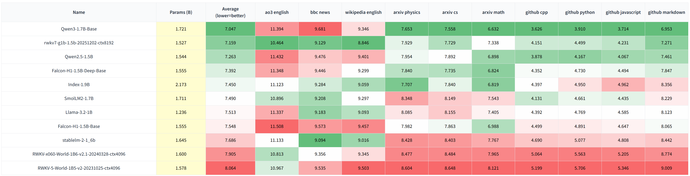
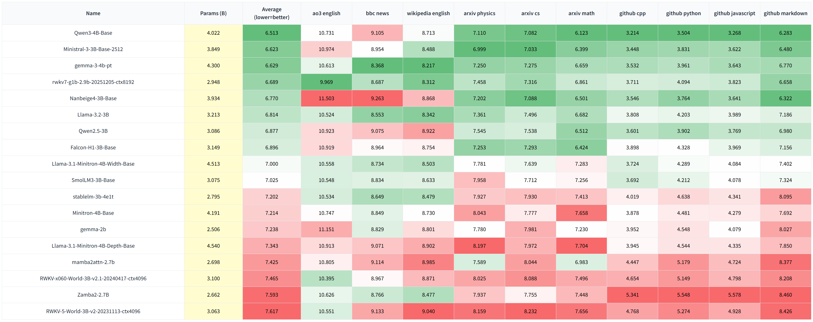
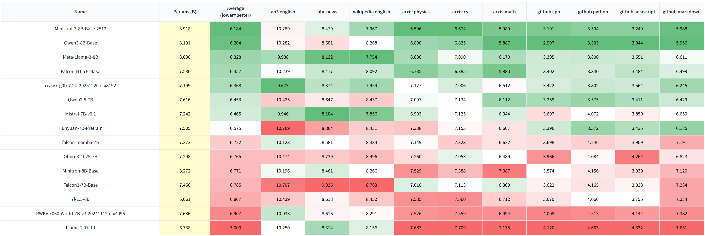
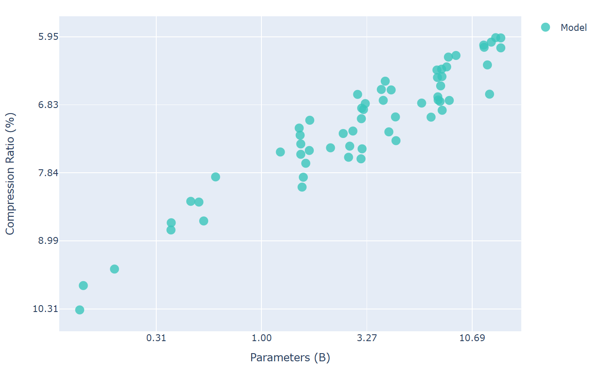
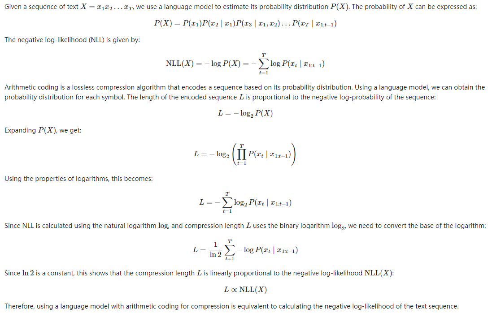

# Uncheatable Eval

[](https://zenodo.org/doi/10.5281/zenodo.11284692) [](https://huggingface.co/spaces/Jellyfish042/UncheatableEval) [](https://huggingface.co/collections/Jellyfish042/uncheatableeval)

## Introduction
Traditional LLM benchmarks are easily compromised by unintentional or intentional data leakage, making many benchmarks unreliable and unable to truly reflect the capabilities of LLMs.

Uncheatable Eval addresses this issue by testing LLMs on real-time, newly generated data from the internet, 
ensuring that the evaluation is immune to data leaks and cannot be gamed.

## How?
Uncheatable Eval assesses the language modeling capabilities of LLMs on new data from various sources such as recent papers on arXiv, new projects on GitHub, news articles, and more. Since this data is brand new (e.g., from the past 1-2 weeks), it is impossible for these data to be included in the training sets of publicly released models, thus avoiding the impact of unintentional or intentional data leaks.

Specifically, we calculate the sum of negative log probabilities of the models on these texts. In other words, models that are more likely to generate these texts are considered better.

*Note*: Uncheatable Eval is designed to evaluate **base models** only.

# Guide

**Uncheatable Eval** now supports the evaluation of typical **Hugging Face AutoModelForCausalLM** models, **RWKV** models and **Mamba** models.

## Evaluation

Determine the optimal `bos_mode` for your model first. Use `bos_mode_finder.py` to automatically detect the best setting for Hugging Face `AutoModelForCausalLM` models unless you know what you are doing.

```bash
python bos_mode_finder.py --model_name_or_path="Qwen/Qwen3-0.6B-Base" --tokenizer_name="Qwen/Qwen3-0.6B-Base"
```

Tips:

- Do not assume that using the official tokenizer's bos_token is always correct.

- Refer to `eval_multi.py` for configuration examples of other models.

Modify the `EvaluationConfig` in `eval_single.py` to set up the evaluation:

```python
config = EvaluationConfig(
    # huggingface model name or local model path
    model_name_or_path="Qwen/Qwen3-0.6B-Base",
    # huggingface tokenizer name or local tokenizer path
    tokenizer_name="Qwen/Qwen3-0.6B-Base",
    # 'hf' for huggingface model, 'rwkv' for rwkv model, 'mamba' for mamba model
    model_type="hf",
    # how to handle the bos token, only work for hf models, use bos_mode_finder.py to find the best bos mode unless you know what you are doing
    bos_mode="add_default_eos",
    # the script will automatically download the datasets from the Hugging Face Hub
    # more datasets can be found at https://huggingface.co/collections/Jellyfish042/uncheatableeval
    data=["Jellyfish042/UncheatableEval-2025-12"],
)
```

Start the evaluation:
```bash
python eval_single.py
```

## Visualization

Run `show_results.ipynb` to visualize the evaluation results.


## LLM Compressor

The LLM compressor implements proof-of-concept text compression using language models with arithmetic coding. It demonstrates the relationship between language modeling capability and compression performance.

**WARNING:** This is a slow proof-of-concept implementation, not practical for real-world use.

### Compression with HuggingFace Models (Use Qwen3-0.6B-Base as default model)

```bash
python llm_compressor.py support/the_egg.txt compressed.bin --task compress
```

### Compression with RWKV7 Models

```bash
python llm_compressor.py support/the_egg.txt compressed.bin --model "path/to/model.pth" --model_type rwkv7 --tokenizer "rwkv_vocab_v20230424" --task compress
```

### Decompression with HuggingFace Models (Use Qwen3-0.6B-Base as default model)

```bash
python llm_compressor.py compressed.bin output.txt --task decompress
```

### Decompression with RWKV7 Models

```bash
python llm_compressor.py compressed.bin output.txt --model "path/to/model.pth" --model_type rwkv7 --tokenizer "rwkv_vocab_v20230424" --task decompress
```

## Data Collection

This project provides Scrapy-based crawlers to collect custom evaluation data. Navigate to the `crawler` directory to get started:

```bash
cd crawlers
```

### GitHub Crawler

**Prerequisite:** A GitHub Access Token is required.

```bash
scrapy crawl github -a access_token="<YOUR_ACCESS_TOKEN>" -a start_date="<START_DATE>" -a end_date="<END_DATE>" -a language="<LANGUAGE>"

```

**Example:**

```bash
scrapy crawl github -a access_token="xxxxxx" -a start_date="2025-12-01" -a end_date="2025-12-15" -a language="py"

```

**Supported values for `language`:**

* `py` (Python)
* `cpp` (C++)
* `js` (JavaScript)
* `ts` (TypeScript)
* `md` (Markdown)
* `other` (Other)

### AO3 Crawler

```bash
scrapy crawl ao3 -a start_date="2025-12-01" -a end_date="2025-12-15" -a language="english"

```

**Supported values for `language`:**

* `english` (English)
* `chinese` (Chinese)
* `nonenglish` (Non-English)

### BBC News Crawler

```bash
scrapy crawl bbc -a start_date="2025-12-01" -a end_date="2025-12-15"

```

### arXiv Crawler

```bash
scrapy crawl arxiv -a start_date="2025-12-01" -a end_date="2025-12-15" -a classification="computer_science"

```

**Supported values for `classification`:**

* `computer_science` (Computer Science)
* `physics` (Physics)
* `mathematics` (Mathematics)
* `other` (Other)

### Wikipedia Crawler

```bash
scrapy crawl wikipedia -a start_date="2025-12-01" -a end_date="2025-12-15"

```

**Supported values for `language`:**

* `english` (English)
* `nonenglish` (Non-English)

> **Note:** For the AO3, arXiv, BBC News, and Wikipedia crawlers, you may need to configure a proxy for reliable data scraping. Set the `ROTATING_PROXY_LIST` environment variable before running the crawler:
> ```bash
> # Linux/macOS
> export ROTATING_PROXY_LIST="http://127.0.0.1:8890"
>
> # Windows
> set ROTATING_PROXY_LIST=http://127.0.0.1:8890
> ```

---


## Q&A
### Why Calculate the Sum of Negative Log Probabilities?
First, the goal of language models, at least today's language models, is to generate text that is as realistic as possible, maximizing the probability of real text. They are trained and designed to do exactly this. Calculating the sum of negative log probabilities on real text is the most direct way to test this capability.

Second, from the perspective of "compression is intelligence," a good way to test a language model would be to use the model with an entropy coding algorithm for compression and test the model's compression rate [[1]](https://arxiv.org/abs/2309.10668)[[2]](https://arxiv.org/abs/2402.00861). A model with a lower compression rate is considered better. Using a language model + arithmetic coding as an example, it is easy to prove that a model's ability to compress a piece of text is proportional to the sum of its negative log probabilities on that text (see [proof](#proof-of-the-equivalence-between-compression-capability-and-negative-log-probability-sum)).
Therefore, the compression rate of a model can be directly calculated through the sum of negative log probabilities, and the method for this has been provided in `show_results_v2.ipynb`.
### Can Models Using Different Tokenizers Be Directly Compared?
Yes. When calculating the sum of negative log probabilities, we essentially treat the model + tokenizer as a single entity or system. As long as this system has a high probability of generating real text, we consider it better. From the perspective of compression, you can choose any tokenizer. From the compression rate perspective, we don't care; we only care about whether your system can compress the text more effectively.

# Results

~1.5B models



---

~3B models



---

~7B models



---

~14B models


---

Scaling law



---

## Proof of the Equivalence Between Compression Capability and Negative Log Probability Sum



```
@software{uncheatable_eval,
  author       = {Jellyfish042},
  title        = {Uncheatable Eval},
  month        = may,
  year         = 2024,
  publisher    = {Zenodo},
  version      = {0.1},
  doi          = {10.5281/zenodo.11284692},
  url          = {https://zenodo.org/record/11284692}
}
```