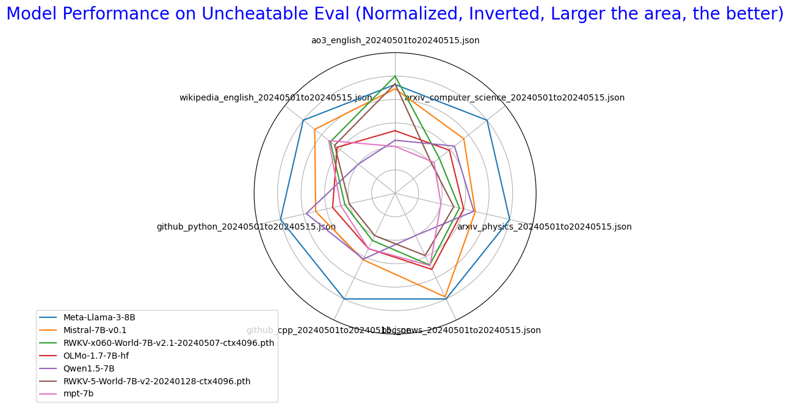
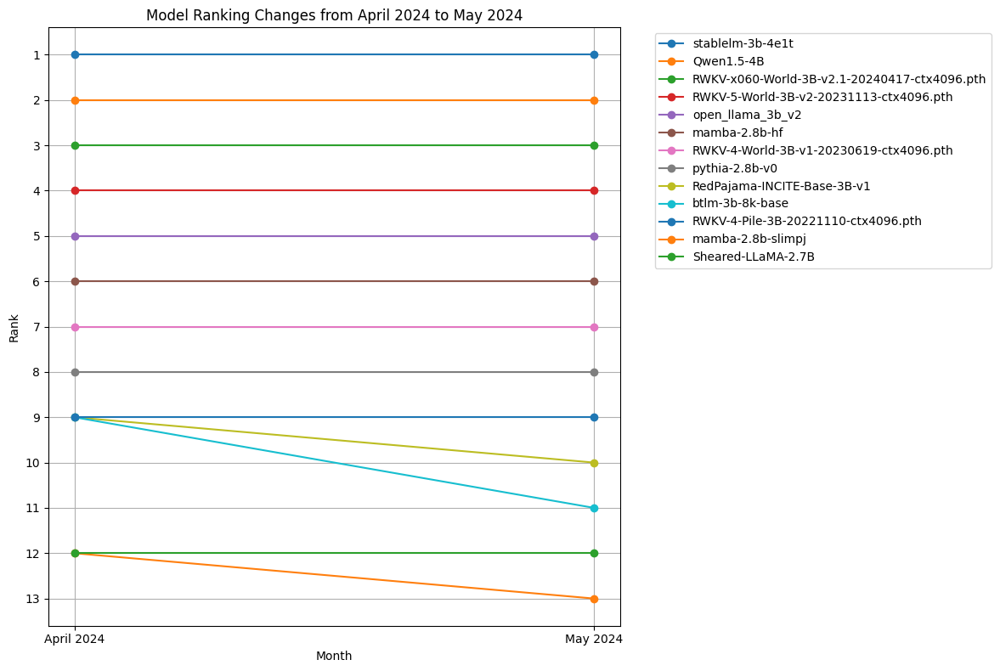

# Uncheatable Eval

[](https://zenodo.org/doi/10.5281/zenodo.11284692) [](https://huggingface.co/spaces/Jellyfish042/UncheatableEval)

## Introduction
Traditional LLM benchmarks are easily compromised by unintentional or intentional data leakage, making many benchmarks unreliable and unable to truly reflect the capabilities of LLMs.

Uncheatable Eval addresses this issue by testing LLMs on real-time, newly generated data from the internet, 
ensuring that the evaluation is immune to data leaks and cannot be gamed.

## How?
Uncheatable Eval assesses the language modeling capabilities of LLMs on new data from various sources such as recent papers on arXiv, new projects on GitHub, news articles, and more. Since this data is brand new (e.g., from the past 1-2 weeks), it is impossible for these data to be included in the training sets of publicly released models, thus avoiding the impact of unintentional or intentional data leaks.

Specifically, we calculate the sum of negative log probabilities of the models on these texts. In other words, models that are more likely to generate these texts are considered better.

*Note* : Uncheatable Eval only tests base models.

# Guide

**Uncheatable Eval** now supports the evaluation of typical **Hugging Face AutoModelForCausalLM** models and **RWKV** models. By following these three simple steps, you can easily obtain evaluation results:

## Step 1: Prepare Datasets

2 options for preparing your dataset:

- Use the datasets provided in the `data` directory.
- Open `multi_site_crawler.sh`, modify `START_DATE`, `END_DATE`, and `GITHUB_ACCESS_TOKEN`, then run the script to fetch real-time data.

*Note* : 

AO3 has a strict rate limit (20 requests per minute), you can implement your own proxy strategy in proxy.py and then set max_worker to a higher value to avoid rate limiting, or wait for a longer time.

Wikipedia crawler does not support fetching data older than one month.

## Step 2: Evaluate Models

### Evaluating a Single Model

- Uncheatable Eval now supports the Hugging Face `AutoModelForCausalLM` and RWKV models (in `.pth` format). Change the configuration in `eval_single.py` to specify the model, model type, tokenizer, and data to be evaluated.
for example:
```python
config = EvaluationConfig(
    model_name_or_path='stabilityai/stablelm-2-1_6b',  # huggingface model name or local model path
    tokenizer_name='stabilityai/stablelm-2-1_6b',  # huggingface tokenizer name or local tokenizer path
    model_type='hf',  # 'hf' for huggingface model, 'rwkv' for rwkv model
    data=['data/ao3_english_20240501to20240515.json']  # list of data files to evaluate
)
```
then run `eval_single.py` to evaluate the model.

### Batch Evaluation of Multiple Models

- You can also use `eval_multi.py` to batch evaluate multiple models on multiple datasets. Simply add the configurations in config_list and run the script.

## Step 3: Parse and Visualize Results

- Run `show_results.ipynb` to parse and visualize the evaluation results.

## Q&A
### Why Calculate the Sum of Negative Log Probabilities?
First, the goal of language models, at least today's language models, is to generate text that is as realistic as possible, maximizing the probability of real text. They are trained and designed to do exactly this. Calculating the sum of negative log probabilities on real text is the most direct way to test this capability.

Second, from the perspective of "compression is intelligence," a good way to test a language model would be to use the model with an entropy coding algorithm for compression and test the model's compression rate [[1]](https://arxiv.org/abs/2309.10668)[[2]](https://arxiv.org/abs/2402.00861). A model with a lower compression rate is considered better. Using a language model + arithmetic coding as an example, it is easy to prove that a model's ability to compress a piece of text is proportional to the sum of its negative log probabilities on that text (see [proof](#proof-of-the-equivalence-between-compression-capability-and-negative-log-probability-sum)).
Therefore, the compression rate of a model can be directly calculated through the sum of negative log probabilities, and the method for this has been provided in `show_results_v2.ipynb`.
### Can Models Using Different Tokenizers Be Directly Compared?
Yes. When calculating the sum of negative log probabilities, we essentially treat the model + tokenizer as a single entity or system. As long as this system has a high probability of generating real text, we consider it better. From the perspective of compression, you can choose any tokenizer. From the compression rate perspective, we don't care; we only care about whether your system can compress the text more effectively.

### Is It Really Uncheatable? Can't I train my model on a large number of arXiv papers to improve its test performance on arXiv papers?
Uncheatable Eval's data sources currently include new arXiv papers, new GitHub projects, BBC news, AO3 fanfictions, and new Wikipedia entries, with more sources to be added in the future. If you genuinely achieve excellent results across these data by training extensively on these sources, I would consider you to have developed a genuinely good language model rather than cheating.

From my test results, accurately modeling these data is very challenging. I believe Uncheatable Eval more accurately reflects the value of every bit of data and computing you invest compared to other benchmarks. Models trained with more data and computing are almost always better, and there are no shortcuts. This is a key strength of Uncheatable Eval.

### Is This Too "Random"? Why Consider Random Texts from the Internet as Ground Truth?
This is why we choose rigorous and verified texts such as arXiv papers and news reports, which typically have better quality. Additionally, a round of Uncheatable Eval evaluates a model over millions of tokens, increasing the reliability of the results.

In fact, the model rankings obtained through Uncheatable Eval are very stable. For instance, the model ranked first in January's data is highly likely to remain first in February, March, April, May, and June, indicating that the data obtained through this method is sufficiently representative.

# Results

~1.5B models


---


---

~3B models


---


---

~7B models



---


---

Changes in Model Rankings Over Time (Excluding Wikipedia Data)


---



---

## Proof of the Equivalence Between Compression Capability and Negative Log Probability Sum


```
@software{uncheatable_eval,
  author       = {Jellyfish042},
  title        = {Uncheatable Eval},
  month        = may,
  year         = 2024,
  publisher    = {Zenodo},
  version      = {0.1},
  doi          = {10.5281/zenodo.11284692},
  url          = {https://zenodo.org/record/11284692}
}
```